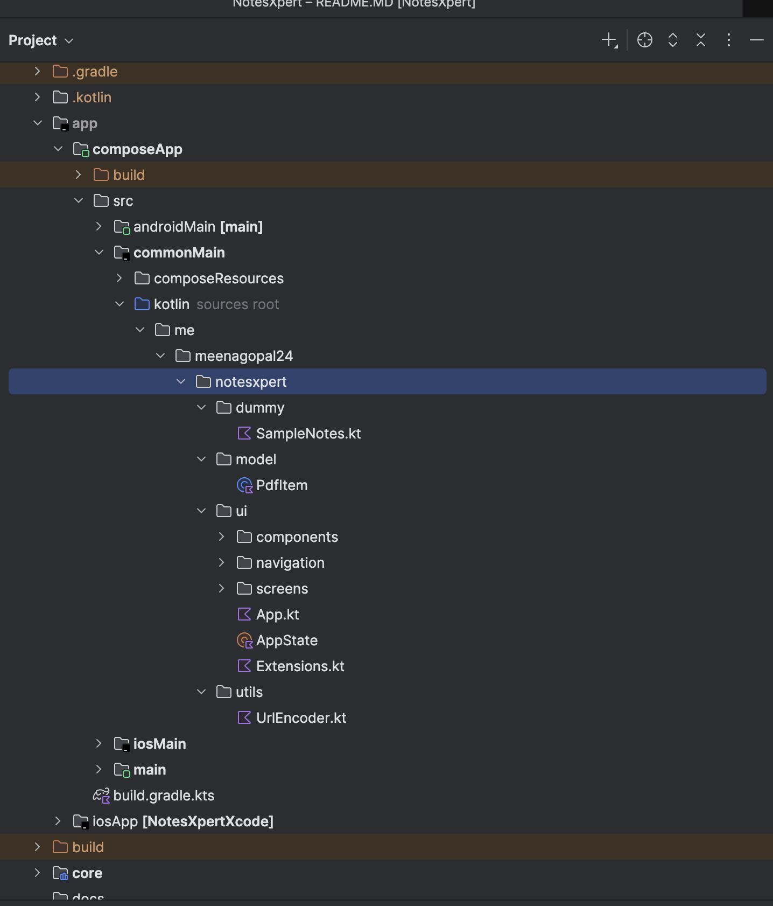
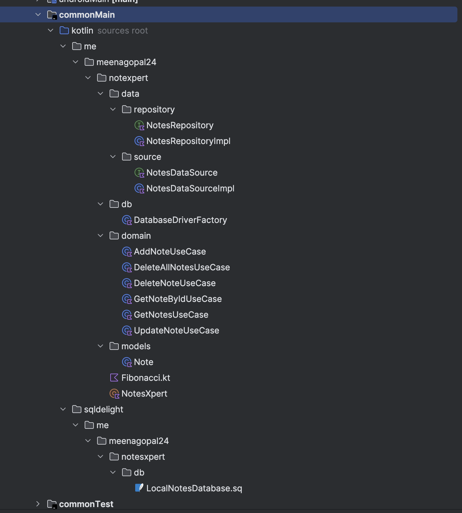

# Project Name

## Project Structure

The project is organized into two main modules for a clean and maintainable architecture:

### App Module (UI)
- Contains all UI components, screens, and navigation.
- Built entirely with Jetpack Compose.
- Handles user interactions and displays data from the core module.  
  

### Core Module (MVVM)
- Implements the **MVVM architecture** with the following layers:
  - **Domain** – Business logic and use cases.
  - **Data** – Local (SQLDelight) and remote data sources.
  - **Repository** – Abstraction layer providing data to ViewModels.
- Provides a reusable, testable, and modular backbone for the app.  
  

## Architecture Explanation

The project follows a modular MVVM architecture:

- **Separation of Concerns** – UI (app module) is decoupled from business logic and data (core module).
- **Data Flow** – Repositories fetch data from local or remote sources, ViewModels expose state to Compose UI.
- **Core Module Reusability** – Can be reused across multiple apps or features.

## Libraries Used

- **SQLDelight** – Type-safe SQLite database access.
- **KotlinX DateTime** – Date and time manipulation.
- **Kermit** – Structured logging.
- **Other Standard Android Libraries** – Jetpack Compose, Navigation, Material 3.

## HTML & PDF Handling

The project handles HTML content and PDF interactions using a **JavaScript bridge** to communicate between the web content and the native app.

### Implementation

To handle link clicks or messages from HTML/JS content:

```kotlin
webView.addJavascriptInterface(
    JavaScriptBridge { msg ->
        onLinkClick(msg)
    },
    "JavaScriptBridge"
)
````

Define the bridge class:

```kotlin
class JavaScriptBridge(
    private val onMessage: (String) -> Unit
) {
    @JavascriptInterface
    fun postMessage(msg: String) {
        onMessage(msg)
    }
}
```

* The `postMessage` method is called from JavaScript inside the HTML or PDF content.
* `onLinkClick(msg)` is a callback in your app to handle the link click or any action triggered from the web content.

## Screen Recording / App Walkthrough

The app walkthrough videos demonstrate the UI and functionality on iOS and Android.

<div style="display: flex; gap: 20px; flex-wrap: wrap;">

<div style="text-align: center; width: 45%;">
  <video width="100%" controls autoplay muted loop>
    <source src="docs/ios.mp4" type="video/mp4">
    Your browser does not support the video tag.
  </video>
  <p>iOS Device</p>
</div>

<div style="text-align: center; width: 45%;">
  <video width="100%" controls autoplay muted loop>
    <source src="docs/android.mp4" type="video/mp4">
    Your browser does not support the video tag.
  </video>
  <p>Android Device</p>
</div>

</div>

### Download APK

You can download the latest Android APK from the `docs` folder:

[Download APK](docs/app.apk)
---
